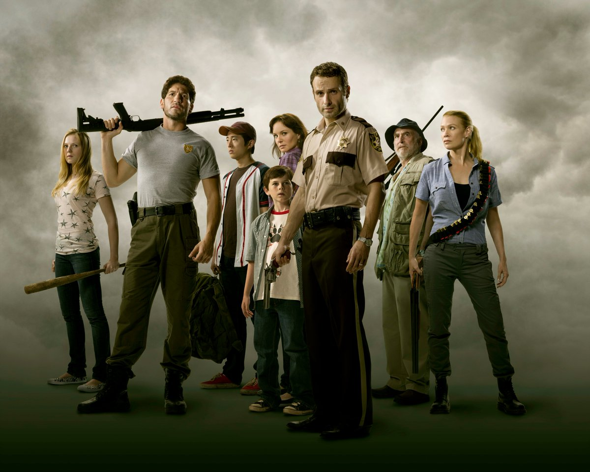

# Welcome to my website!

As part of markdown format we have already seen few things in the class. Now we see how to set some text to **bold** or _italic_ and add image to the website.

My name is **Noormila**. I love to watch _tv shows_ alot.

Here are a few of the _tv shows_ which i've been **binge-watching** lately.
## 1.The Crown.
The crown is a historical drama.The story revolves around the **Queen Elizabeth II** and her reign over **England**.The series begin with the queen's marriage to **prince philip** and her coronation as queen after the demise of her father.Every season of the crown covers over 10 decades.**princess Diana** the wife of **prince charles**(first born child of queen elizabeth II) is the biggest reason for me to watch the series.The best thing about this series is the acting , the potrayal of the characters with the perfect casting.

## 2.Peaky Blinders.
The peaky blinders is a crime drama potrayed after the world war I.The story covers about the **shelby family** and their time in england.The series revolves around them mostly and the occurence of events all along.**Thomas shelby** is one my favorite character in the series.

## 3.The Walking Dead.
The walking Dead is an apocalyptic drama,where few survivors are trapped in the world covered with **zombies** called as **walkers**.The story is lead by a person who is a **sheriff** and was hospitalized before the apocalypse and was into coma.How the **sheriff** awakens and does he re-unite with his family or are they dead ? .How does he survive in this new world is to watch for. 

