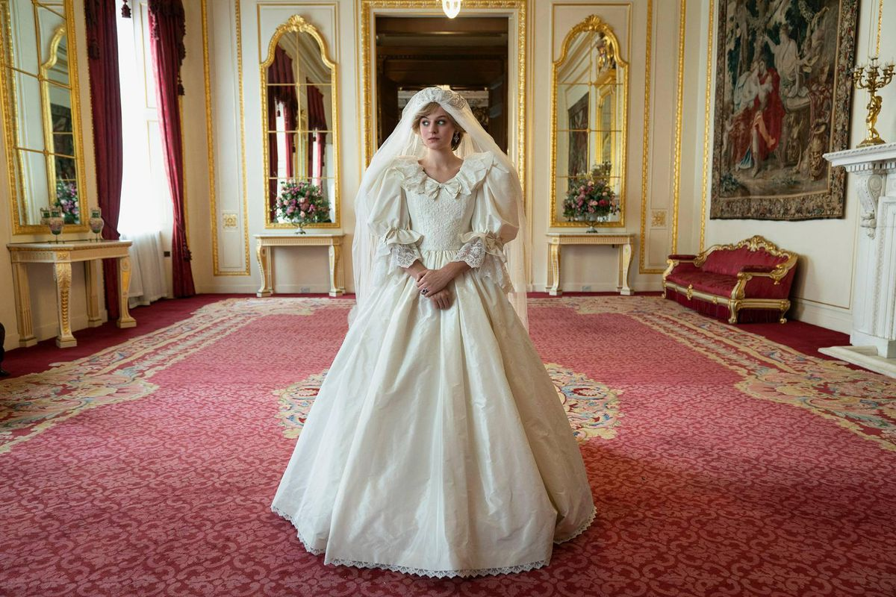
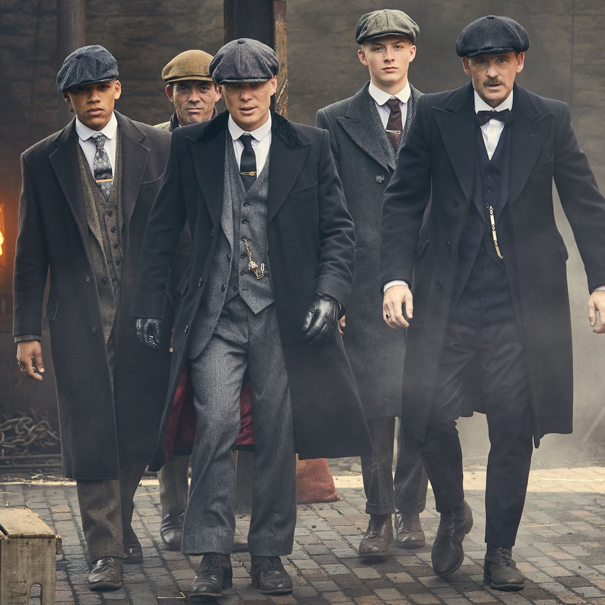

# Welcome to my website!

As part of markdown format we have already seen few things in the class. Now we see how to set some text to **bold** or _italic_ and add image to the website.

My name is **Noormila**. I love to watch _tv shows_ alot.

Here are few of the _tv shows_ which i've been **binge-watching** lately.

